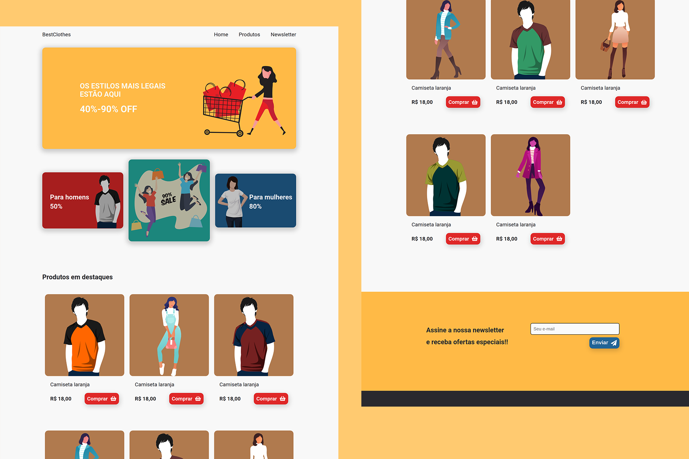

 

  <h3 align="center">BestClothes</h3>

  

    Landing page de e-commerce
  

  
Índice

  <ol>
    <li>
      <a href="#sobre-o-projeto">Sobre o projeto</a>
      <ul>
        <li><a href="#construido-com">Construido com</a></li>
      </ul>
    </li>
    <li><a href="#contato">Contato</a></li>
  </ol>

## Sobre o projeto

 
Esse site é uma landing page de promoções, onde o cliente pode cadastrar seu e-mail para receber promoções. Os e-mails cadastrados são salvos no localstorage.

Link demo: https://bestclothes.netlify.app

## Layout

Você pode visualizar o layout do projeto através do link abaixo:

- [Layout Web](https://www.figma.com/file/gTPtuSRTcxNUXloI8CXiLx/BestClothes?node-id=0%3A1)

Lembrando que você precisa ter uma conta no [Figma](https://www.figma.com).

### Construído com

O projeto foi construído utilizando

- HTML
- CSS
- JavaScript

## Contato

William James - william.james.pj@gmail.com

Link do projeto: [https://github.com/william-james-pj/best-clothes](https://github.com/william-james-pj/best-clothes)
